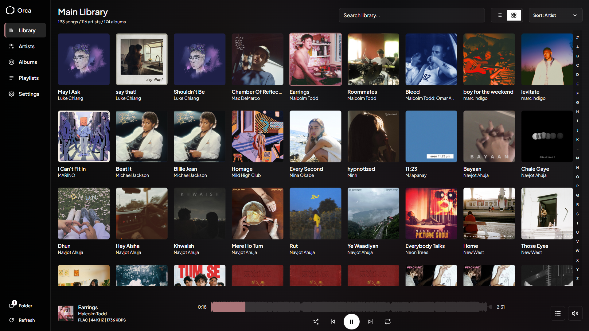
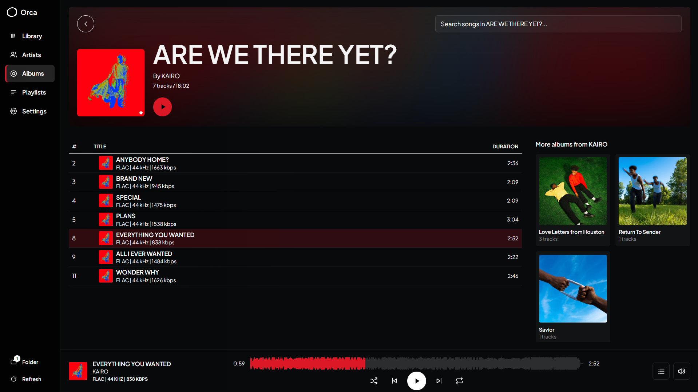
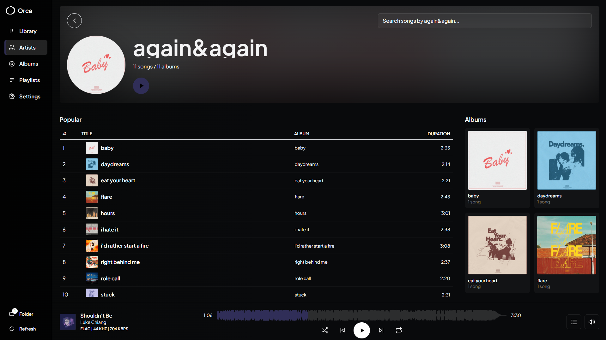
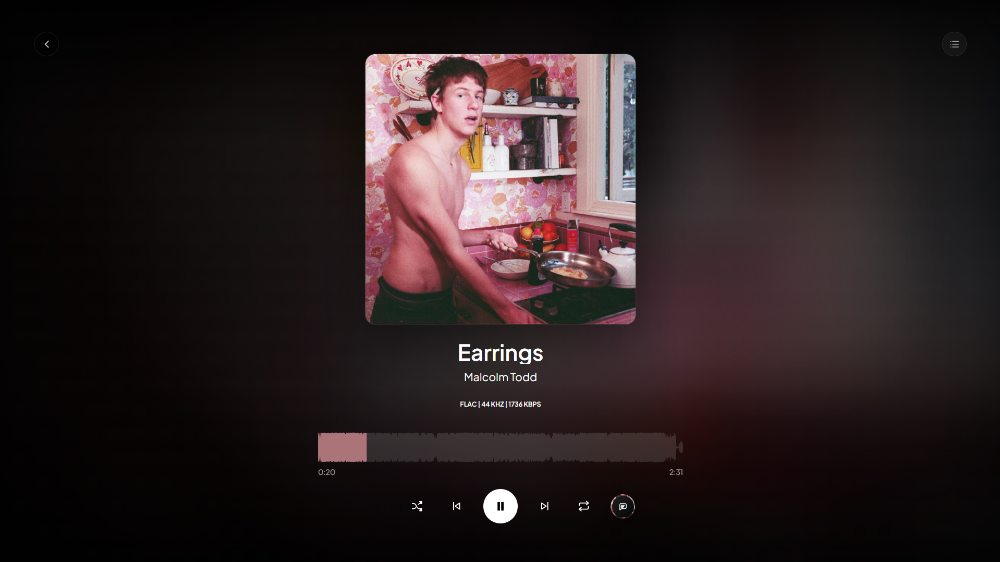
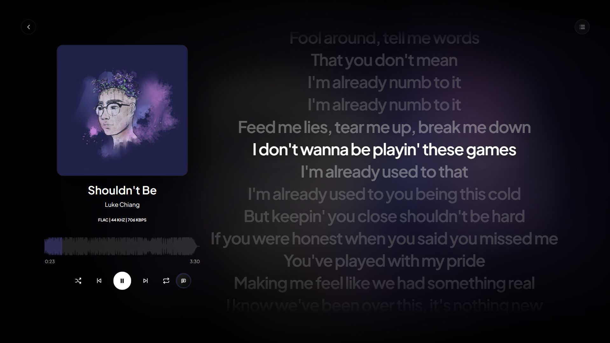
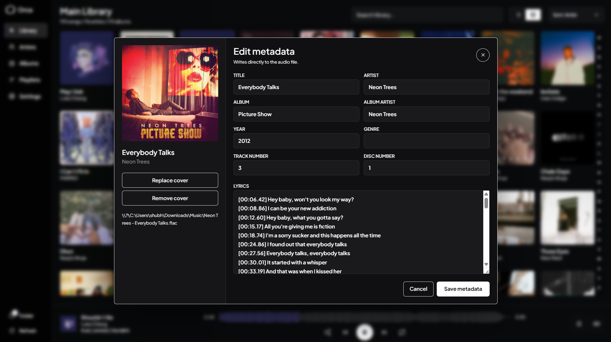

# Orca

Orca is a local music player for Windows built using Svelte 5, Tauri 2, and Rust.

> [!IMPORTANT]
> **Alpha Stage Release:** Orca is currently in active alpha. While it is fully ready for daily listening, it has not yet been benchmarked or stress-tested on libraries exceeding **5,000+ tracks**. If you encounter any visual quirks, bugs, or performance lags, please open an issue to help improve the project!

---

## Key Features

- **Fast Scanning**: Add local directories to scan and build your database instantly. Supports `MP3`, `FLAC`, `M4A`, `WAV`, `OGG`, `OPUS`, and `AIFF` / `AIF` audio files.
- **Audio Engine**: Powered by `rodio` with crossfading support.
- **Waveform Seekbars**: Smooth waveform seekbars generated from the track's audio channels.
- **LRC Lyrics**: Sync with LRCLIB to fetch lyrics, with support for clicking lyric lines to seek.
- **Metadata Editing**: Edit tags (title, artist, album, genre, cover art) directly in the app.
- **Playlists**: Create and manage playlists, including custom playlist cover art.
- **Layouts**: Ambient artwork color backgrounds, sidebar navigation, queue management, and toggleable layout modes.

---

## Screenshots

**Library**: 
**Albums**: 
**Artists**: 
**Full Player**: 
**Synced Lyrics**: 
**Metadata Editor**: 

---

## Tech Stack

* **Frontend**: Svelte 5 (Vite), TypeScript, Tailwind CSS, HTML5 Canvas
* **Backend**: Rust, Tauri 2, SQLite (`rusqlite`)
* **Audio Engine**: Rodio
* **Tagging Library**: Lofty

---

## Repository Structure

```text
src/                 Svelte frontend codebase
src/lib/components/  UI components (Player, Waveform, Metadata, Queue)
src-tauri/           Tauri application backend and command handlers
crates/orca-core/    Core database structure, scanning engine, and audio thread logic
```

---

## Getting Started

### Prerequisites

You will need the following tools installed on your Windows machine:
1. [Rust](https://www.rust-lang.org/tools/install)
2. [Bun](https://bun.sh/)
3. [Tauri Windows Setup Requirements](https://v2.tauri.app/start/prerequisites/)

### Development

Clone the repository and install the dependencies:
```bash
bun install
```

Start the development server with live reload:
```bash
bun run tauri:dev
```

To run the dev server with Rust optimizations (release-level audio decoding speed):
```bash
bun run tauri dev --release
```

---

## Building a Release

Orca uses **NSIS** to bundle a lightweight executable installer for Windows. Building MSI installers is disabled to simplify packaging.

To build the NSIS installer:
```bash
bun run tauri:build
```
The output `.exe` installer will be located in `src-tauri/target/release/bundle/nsis/`.

---

## Contributing & Support

Thank you for checking out Orca! If you would like to help improve the player:
* Feel free to report bugs or suggest features by opening a GitHub Issue.
* Pull requests are always welcome!

## License

MIT License. See [LICENSE](LICENSE) for more details.
