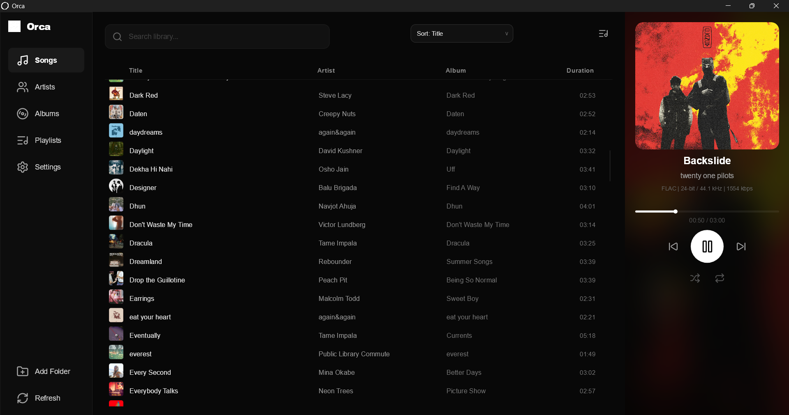
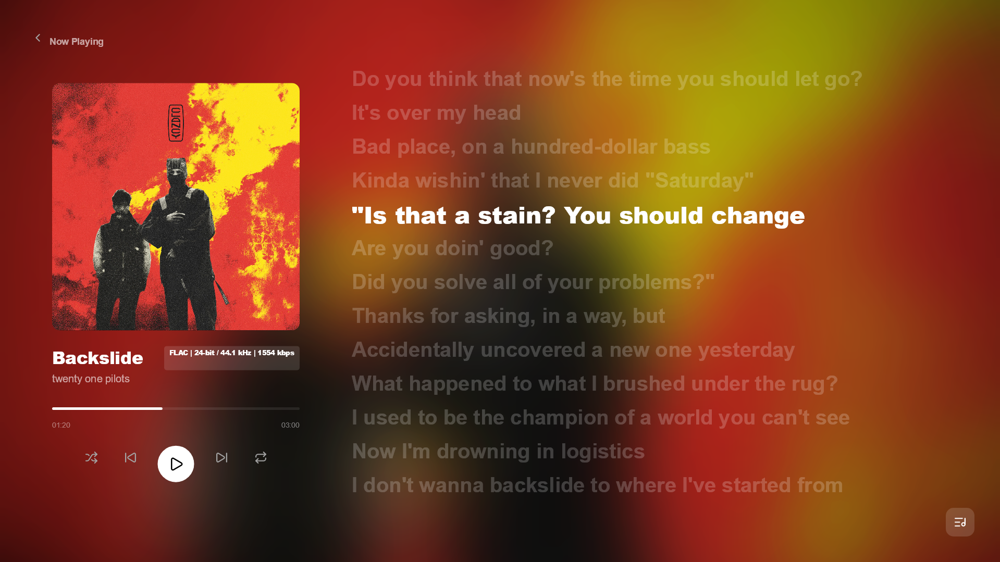

# Orca 🐋

> [!NOTE]
> Orca is currently in active development. Alpha 0.1.0 will be released shortly.

Orca is a desktop music player for local files, built with Rust and the Slint UI framework. It is focused on high-quality audio playback and a clean layout.


## Screenshots

*Orca in action:*

### Main Library


### Main Player



## Features

- **Library Management**: Scan and index local music folders.
- **Lyrics Support**: Displays synced (.lrc) and plain text lyrics.
- **High-Resolution Metadata**: View sample rates, bitrates, and bit depths for your audio files.
- **Search**: Navigate your library with a global search shortcut (Ctrl+K).
- **Interface**: A modern, simple UI with support for customization like monochrome mode.
- **Controls**: Basic playback controls alongside shuffle, repeat, and volume management.

## Keyboard Shortcuts

Orca provides several global and application-level shortcuts for ease of use:

- **Search**: `Ctrl + K` (Focus search bar)
- **Playback**: `Alt + N` (Next track), `Alt + P` (Previous track), `Space` (Play/Pause)
- **Visuals**: `F11` (Toggle Fullscreen), `Ctrl + Shift + M` (Toggle Monochrome mode)
- **System**: `Ctrl + Shift + B` (Show/Hide window globally)

## Supported Formats

Orca supports a variety of standard and high-fidelity audio formats:

- **Lossless**: FLAC, WAV, ALAC (m4a)
- **Compressed**: MP3, AAC (m4a)

## Made With 🛠️

Orca is built using several powerful open-source projects:

- [Rust](https://github.com/rust-lang/rust) - The system language ensuring performance and safety.
- [Slint](https://github.com/slint-ui/slint) - The toolkit powering our modern UI.
- [Lofty](https://github.com/Serial-ATA/lofty-rs) - Metadata extraction and tagging.
- [Rodio](https://github.com/RustAudio/rodio) - Core audio engine for seamless playback.
- [Symphonia](https://github.com/pdeljanov/Symphonia) - Advanced media decoding support.

## Getting Started

### Prerequisites

- [Rust](https://rustup.rs/) (latest stable)
- C++ compiler (for dependencies)

### Usage

1. Clone the repository:
   ```bash
   git clone https://github.com/shubham-pathak1/orca.git
   cd orca
   ```

2. Run the application:
   ```bash
   cargo run --release
   ```

## Contributing

For information on contributing to this project, please see [CONTRIBUTING.md](CONTRIBUTING.md).

## License

This project is licensed under the MIT License. See [LICENSE](LICENSE) for details.
