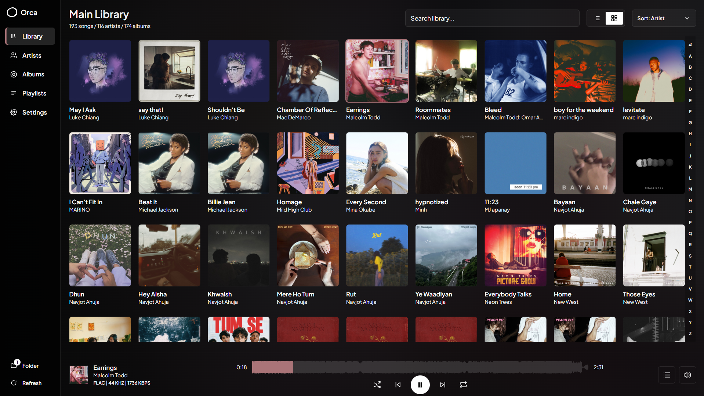
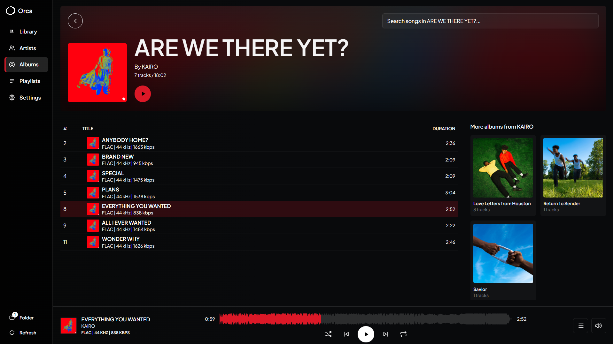
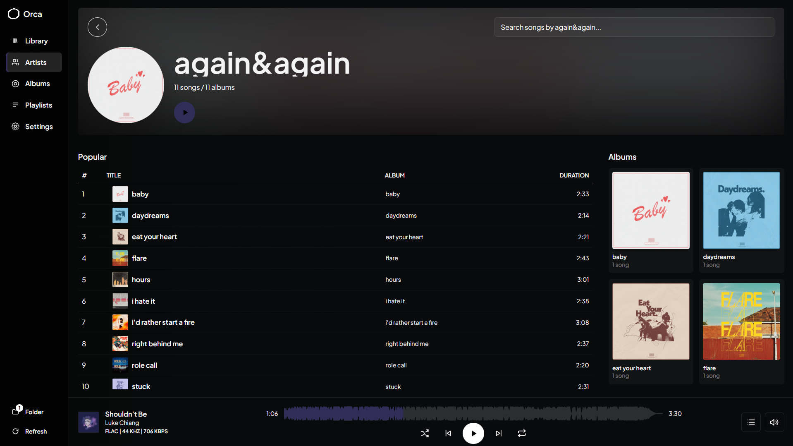
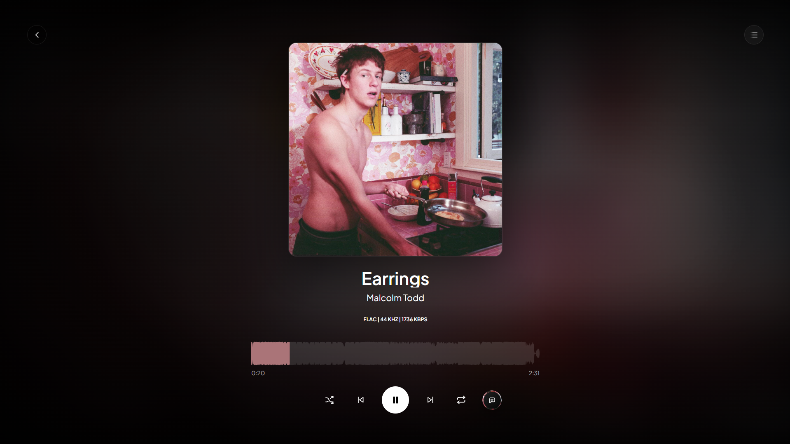
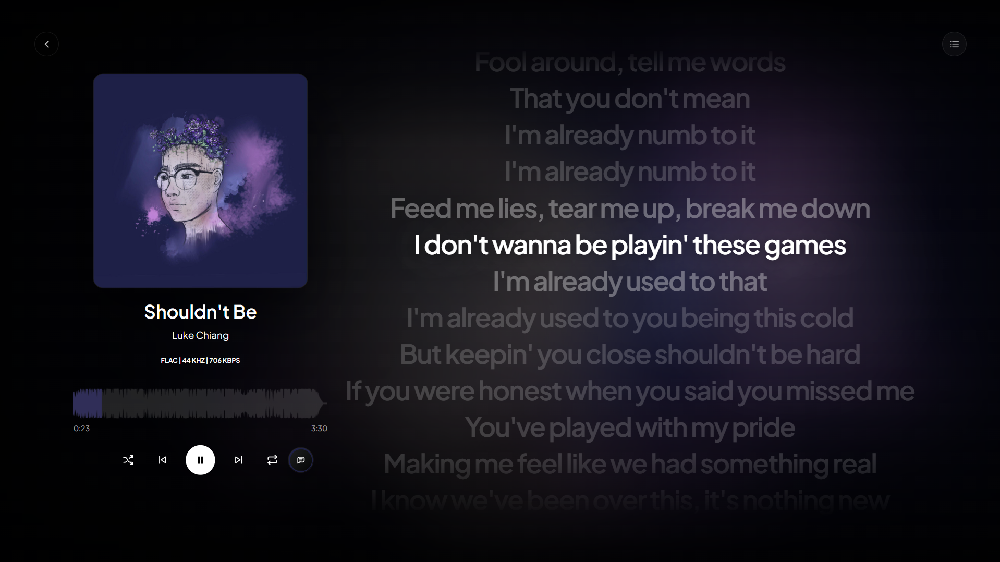
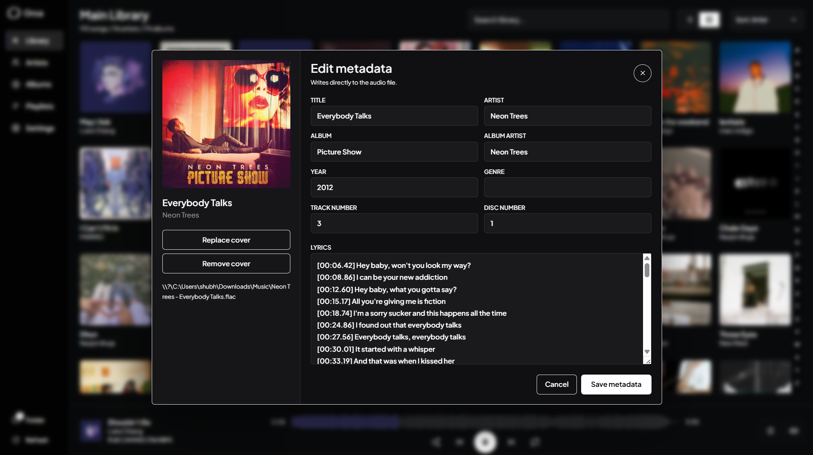

# Orca

Orca is a local music player for Windows built using Svelte 5, Tauri 2, and Rust.

> [!IMPORTANT]
> **Alpha release:** Orca is in active development. Performance and stability on libraries larger than **5,000 tracks** have not been broadly tested yet. Please report bugs or regressions through GitHub Issues.

---

## Key Features

- **Local library**: Scan local folders and keep them updated as files change. Supports `MP3`, `FLAC`, `M4A`, `WAV`, `OGG`, `OPUS`, and `AIFF` / `AIF`.
- **Playback**: Rodio-based audio playback with gapless playback, queue controls, shuffle, repeat, and waveform or standard seeking.
- **Waveforms**: Decode and cache waveform seekbars from the track audio.
- **Lyrics**: Read embedded lyrics first, then fetch and cache timed or plain lyrics from LRCLIB. Click a lyric line to seek, or import a local `.lrc` file through the metadata editor.
- **Metadata**: Edit track tags and cover art directly in the app.
- **Playlists**: Create playlists, set custom covers, and import or export standard M3U playlists.
- **Windows integration**: Taskbar controls, global media shortcuts, and Windows media controls.
- **Player views**: Library, artists, albums, genres, playlists, queue, and a full-player lyrics view.

---

## Screenshots

**Library**: 
**Albums**: 
**Artists**: 
**Full Player**: 
**Synced Lyrics**: 
**Metadata Editor**: 

---

## Tech Stack

* **Frontend**: Svelte 5 (Vite), TypeScript, Tailwind CSS, HTML5 Canvas
* **Backend**: Rust, Tauri 2, SQLite (`rusqlite`)
* **Audio Engine**: Rodio
* **Tagging Library**: Lofty

---

## Repository Structure

```text
src/                 Svelte frontend codebase
src/lib/components/  UI components (Player, Waveform, Metadata, Queue)
src-tauri/           Tauri application backend and command handlers
crates/orca-core/    Core database structure, scanning engine, and audio thread logic
```

---

## Getting Started

### Prerequisites

You will need the following tools installed on your Windows machine:
1. [Rust](https://www.rust-lang.org/tools/install)
2. [Bun](https://bun.sh/)
3. [Tauri Windows Setup Requirements](https://v2.tauri.app/start/prerequisites/)

### Development

Clone the repository and install the dependencies:
```bash
bun install
```

Start the development server with live reload:
```bash
bun run tauri:dev
```

To run the desktop app with Rust release optimizations:
```bash
bun run tauri:dev -- --release
```

---

## Building a Release

Orca uses **NSIS** to bundle a Windows executable installer. MSI installers are disabled to keep packaging simple.

To build the NSIS installer:
```bash
bun run tauri:build
```
The output `.exe` installer will be located in `src-tauri/target/release/bundle/nsis/`.

---

## Contributing & Support

Thank you for checking out Orca! If you would like to help improve the player:
* Feel free to report bugs or suggest features by opening a GitHub Issue.
* Pull requests are always welcome!

## License

MIT License. See [LICENSE](LICENSE) for more details.
